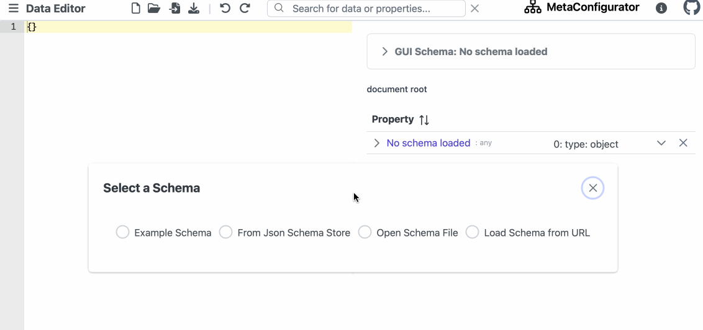
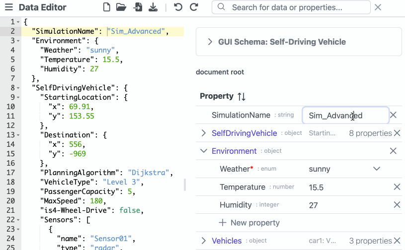
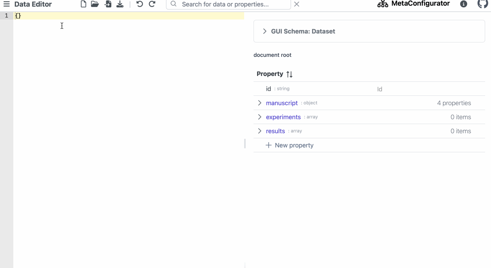

# MetaConfigurator

## Description

MetaConfigurator is a form generator and schema editor for JSON schema,
making editing configuration files, research data and schemas easier and more enjoyable.

Web playground: https://paulbredl.github.io/meta-configurator/

Web playground experimental: https://logende.github.io/meta-configurator/


### Generated form for assisted editing of the JSON file




### Schema Editor


### Interactive Schema Diagram


## Motivation

Creating and managing files that have to conform to a specific format or structure can be a challenging task with a simple text editor,
especially if you are not familiar with the specific file formats or syntax.
For example, if you want to create a GitHub Actions workflow file, you have to follow the specified structure.
This structure is defined in a JSON schema, which is a JSON document that describes the structure of another JSON document.
But how to make sure that the file you created is valid and conforms to the schema?

### Solution

The project offers a GUI-based solution that simplifies the creation and maintenance of configuration files and schemas.
Users can interact with a user-friendly interface that provides intuitive controls and abstracts away the complexities
of file formats and syntax, making it accessible to users with limited technical knowledge.
Our tool has the following advantages:

- It is easy to use and does not require knowledge of the underlying file schema
- It is flexible and can be used for any JSON schema (we currently support draft-2020-12)
- Less error-prone than manually editing configuration files

More details can be found in [our paper](paper/paper_main_extended.pdf) and our [user guide](https://github.com/PaulBredl/meta-configurator/wiki/User-Guide).


## Development

The project relies on [Node Js](https://nodejs.org/en/download/).

We use [vue.js](https://vuejs.org/) as a frontend framework and [PrimeVue](https://www.primefaces.org/primevue/) for the UI components.

### Installation

To launch the application, follow these steps:

1. Clone the repository to your local machine:
   ```shell
   git clone https://github.com/PaulBredl/config-assistant.git
   ```
2. Navigate into web application folder:
   ```sh
   cd meta_configurator
3. Install the necessary dependencies:
   ```sh
   npm install
   ```
4. Launch the application:
   ```sh
   npm run dev
   ```
   

## Citing MetaConfigurator

To cite MetaConfigurator in your publications, please use the following BibTeX entry:

```bibtex
@article{metaconfigurator2024, 
year = {2024}, 
title = {{MetaConfigurator: A User-Friendly Tool for Editing Structured Data Files}}, 
author = {Neubauer, Felix and Bredl, Paul and Xu, Minye and Patel, Keyuriben and Pleiss, Jürgen and Uekermann, Benjamin}, 
journal = {Datenbank-Spektrum}, 
issn = {1618-2162}, 
doi = {10.1007/s13222-024-00472-7}, 
abstract = {{Textual formats to structure data, such as JSON, XML, and YAML, are widely used for structuring data in various domains, from configuration files to research data. However, manually editing data in these formats can be complex and time-consuming. Graphical user interfaces (GUIs) can significantly reduce manual efforts and assist the user in editing the files, but developing a file-format-specific GUI requires substantial development and maintenance efforts. To address this challenge, we introduce MetaConfigurator: an open-source web application that generates its GUI depending on a given schema. Our approach differs from other schema-to-UI approaches in three key ways: 1) It offers a unified view that combines the benefits of both GUIs and text editors, 2) it enables schema editing within the same tool, and 3) it supports advanced schema features, including conditions and constraints. In this paper, we discuss the design and implementation of MetaConfigurator, backed by insights from a small-scale qualitative user study. The results indicate the effectiveness of our approach in retrieving information from data and schemas and in editing them.}}, 
pages = {1--9}
}
```

## License

This project is licensed under the [MIT License](LICENSE).
For more information, see the LICENSE file.
