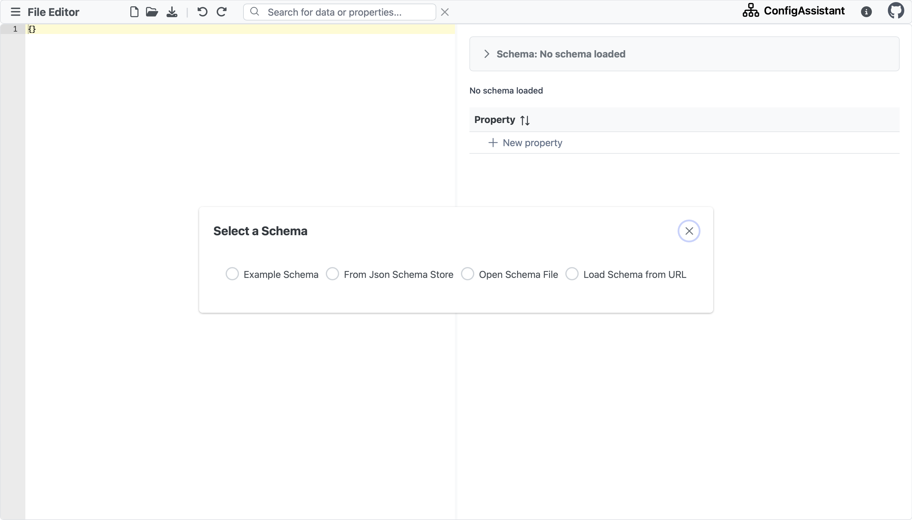

# Config Assistant

## Description

MetaConfigurator is a meta-program that automatically generates GUIs tailored to a given (JSON schema) data schema to make editing configuration files, research data and schemas easier and more enjoyable.

## Problem

Creating and managing configuration files manually can be a daunting task, especially for users who are not familiar with the specific file formats or syntax.
This process often requires understanding complex rules and ensuring accurate formatting, which can lead to errors or inconsistencies.

## Solution

The project offers a GUI-based solution that simplifies the creation and maintenance of configuration files and schemas.
Users can interact with a user-friendly interface that provides intuitive controls and abstracts away the complexities of file formats and syntax, making it accessible to users with limited technical knowledge.

The benefits of using this tool include:

1. Ease of use: The GUI allows users to generate configuration files effortlessly, even without prior knowledge of the file formats or syntax.
2. Time-saving: By combining the Code panel and the GUI panel in one view, maximum efficiency can be achieved.
3. Error reduction: The tool ensures that the generated files conform to the specified format and structure, reducing the likelihood of syntax errors or inconsistencies.

## Features

- User-friendly GUI for generating configuration files
- Support for multiple file formats (e.g., JSON, YAML)

## Dependencies

The project relies on the following dependencies:

- [Node Js + npm](https://nodejs.org/en/download/) (npm comes with node js)

Make sure to install these dependencies before running the project.

## Recommended IDE Setup

[WebStorm](https://www.jetbrains.com/webstorm/download/)

[Vue.js](https://cli.vuejs.org/guide/installation.html)

[Vite](https://v3.ru.vuejs.org/guide/installation.html)

## Customize configuration

See [Vite Configuration Reference](https://vitejs.dev/config/).

## Installation

To launch the application, follow these steps:

1. Clone the repository to your local machine:
   ```shell
   git clone https://github.com/PaulBredl/config-assistant.git
   ```
2. Navigate to the project directory:
   ```shell
   cd your-repository
   ```
3. Install the necessary dependencies:
   ```sh
   npm install
   ```
4. Launch the application:
   ```sh
   npm run dev
   ```
5. Compile and Minify for Production
   ```sh
   npm run build
   ```

## Screenshot



## Contribution

**Contribution we only accept after 10/2023.**

Contributions to the project are welcome! If you would like to contribute, please follow the guidelines outlined in the project's contribution guide located in the repository.

## License

This project is licensed under the [MIT License](LICENSE).
For more information, see the LICENSE file.

## Contact

If you have any questions, suggestions, or feedback, feel free to contact the project team at
[kkpatel.de@gmail.com](mailto:kkpatel.de@gmail.com),
[minyexu@gmail.com](mailto:minyeexu@gmail.com), [Felix@neuby.de](mailto:Felix@neuby.de),
[paulbredl@gmx.de](mailto:cpaulbredl@gmx.de).
