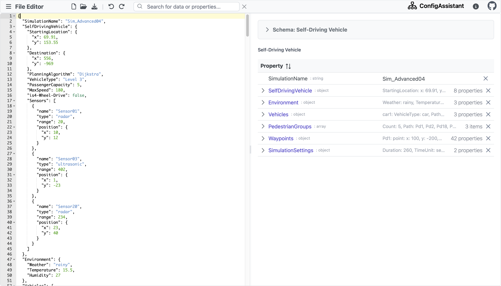

# MetaConfigurator

## Description

MetaConfigurator is a web app that automatically generates a GUI tailored to a given JSON schema
to make editing configuration files, research data and schemas easier and more enjoyable.

Web playground: https://logende.github.io/meta-configurator/

## Problem

Creating and managing files that have to conform to a specific format or structure can be a challenging task with a simple text editor,
especially if you are not familiar with the specific file formats or syntax.
For example, if you want to create a GitHub Actions workflow file, you have to follow the specified structure.
This structure is defined in a JSON schema, which is a JSON document that describes the structure of another JSON document.
But how to make sure that the file you created is valid and conforms to the schema?

## Solution

The project offers a GUI-based solution that simplifies the creation and maintenance of configuration files and schemas.
Users can interact with a user-friendly interface that provides intuitive controls and abstracts away the complexities
of file formats and syntax, making it accessible to users with limited technical knowledge.
Our tool has the following advantages:

- It is easy to use and does not require knowledge of the underlying file schema
- It is flexible and can be used for any JSON schema (we currently support draft-2020-12)
- Less error-prone than manually editing configuration files

More details can be found in [our paper](paper/paper_main_extended.pdf) and our [user guide](https://github.com/PaulBredl/meta-configurator/wiki/User-Guide).

## Screenshot



## Development

The project relies on [Node Js](https://nodejs.org/en/download/).

We use [vue.js](https://vuejs.org/) as a frontend framework and [PrimeVue](https://www.primefaces.org/primevue/) for the UI components.

### Installation

To launch the application, follow these steps:

1. Clone the repository to your local machine:
   ```shell
   git clone https://github.com/PaulBredl/config-assistant.git
   ```
2. Navigate into web application folder:
   ```sh
   cd meta_configurator
3. Install the necessary dependencies:
   ```sh
   npm install
   ```
4. Launch the application:
   ```sh
   npm run dev
   ```

## License

This project is licensed under the [MIT License](LICENSE).
For more information, see the LICENSE file.

