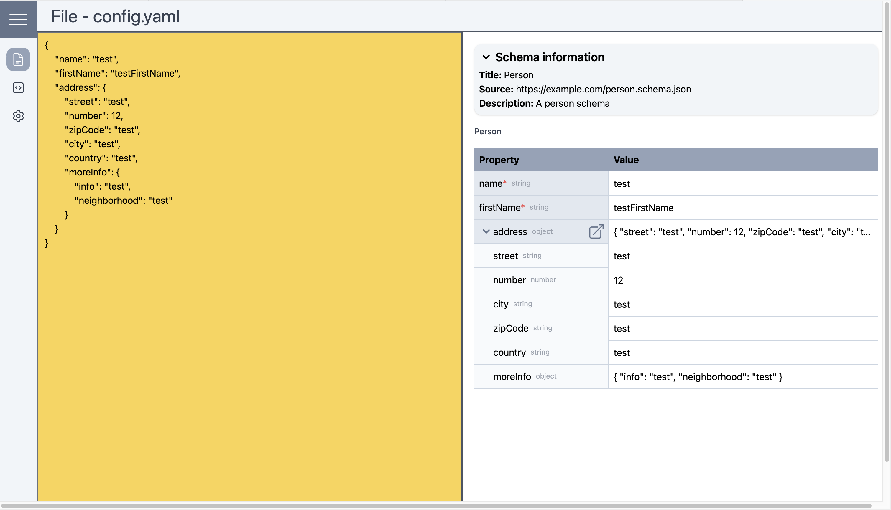

# Meta Configurator
## Description
The project aims to solve the problem of manual creation and understanding of configuration files by providing a user-friendly GUI (Graphical User Interface) tool. With this tool, users can effortlessly generate various types of configuration files, such as JSON, YAML, and more, without the need for deep knowledge of their syntax or structure.Additionally, users can share the generated configuration files with others and allow them to update and modify the files.

## Problem

Creating and managing configuration files manually can be a daunting task, especially for users who are not familiar with the specific file formats or syntax. This process often requires understanding complex rules and ensuring accurate formatting, which can lead to errors or inconsistencies. Furthermore, sharing configuration files with others and enabling them to update and modify the files in a controlled manner can be challenging.

## Solution
The project offers a GUI-based solution that simplifies the creation, sharing, and updating of configuration files. Users can interact with a user-friendly interface that provides intuitive controls and options to configure their settings. The tool abstracts away the complexities of file formats and syntax, making it accessible to users with limited technical knowledge. Additionally, the generated configuration files can be easily shared with others, allowing collaboration and updates.

The benefits of using this tool include:

1. Ease of use: The GUI allows users to generate configuration files effortlessly, even without prior knowledge of the file formats or syntax.
2. Time-saving: With automated generation, users can swiftly create multiple configuration files with different settings, reducing manual effort and saving time.
3. Error reduction: The tool ensures that the generated files conform to the specified format and structure, reducing the likelihood of syntax errors or inconsistencies.
4. Collaboration: Users can share the generated configuration files with others, enabling collaboration and updates.

## Features

- User-friendly GUI for generating configuration files
- Support for multiple file formats (e.g., JSON, YAML)
- Intuitive controls and options for configuring settings
- Ability to generate multiple files with different settings
- Validation and error handling to ensure accurate file generation
- Easy sharing of generated configuration files with others
- Mechanisms for controlled updates and modifications
- Version tracking and revision history for shared configuration files

## Installation

To use the project, follow these steps:

1. Clone the repository to your local machine.
2. Install the necessary dependencies as mentioned in the project's documentation add fullfill prerequisite
3. Launch the GUI application.
4. Customize the settings as desired.
5. Generate the configuration files with the click of a button.
6. Share the generated configuration files with others.

For more detailed installation instructions and usage examples, refer to the project's documentation in the repository.

## Dependencies

The project relies on the following dependencies:

- [Node Js + npm](https://nodejs.org/en/download/) (npm comes with node js)


Make sure to install these dependencies before running the project.

## Recommended IDE Setup

[WebStorm](https://www.jetbrains.com/webstorm/download/)

[Vue.js](https://cli.vuejs.org/guide/installation.html)

[Vite](https://v3.ru.vuejs.org/guide/installation.html)


## Customize configuration

See [Vite Configuration Reference](https://vitejs.dev/config/).

## Getting Started

To launch the application, follow these steps:

1. Clone the repository to your local machine:
   ```shell
   git clone https://github.com/PaulBredl/meta-configurator.git
2. Navigate to the project directory:
    ```shell
   cd your-repository
3. Install the necessary dependencies:
   ```sh
   npm install
   ```
4. Launch the application:
   ```sh
   npm run dev
   ```
5. Compile and Minify for Production
   ```sh
   npm run build
   ```
## Screenshot



## Contribution
**Contribution we only accept after 10/2023.**

Contributions to the project are welcome! If you would like to contribute, please follow the guidelines outlined in the project's contribution guide located in the repository.

## License
This project is licensed under the [MIT License](LICENSE).
For more information, see the LICENSE file.

## Contact

If you have any questions, suggestions, or feedback, feel free to contact the project team at 
[kkpatel.de@gmail.com](mailto:contact@example.com),
[minyeexu@gmail.com](mailto:contact@example.com), [Felix@neuby.de](mailto:contact@example.com), 
[paulbredl@gmx.de](mailto:contact@example.com).


