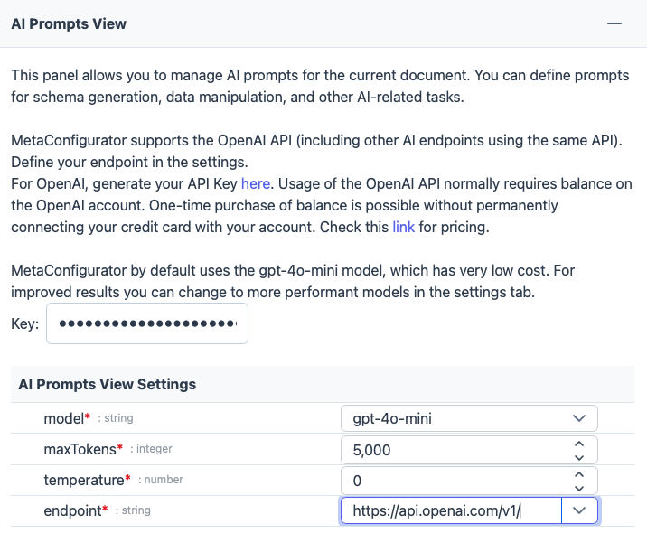

# AI Assistance

## Overview

MetaConfigurator provides different AI-assisted features to help you create and edit JSON schemas and instance data using natural language inputs.

Demonstration and Introduction video from the Allotrope Connect Workshop 2025 (click the image to open the video on Youtube):

## Requirements

To use the AI-assisted features, you need to have an OpenAI API key (or API key of another LLM endpoint provider). 
You can obtain an API key by signing up on the [OpenAI website](https://platform.openai.com/signup/).

## Endpoint Configuration

To configure the LLM endpoint, open an AI-assisted feature (e.g., `Show AI Prompts View` button in the top menu bar) and expand the expandable/collapsible dialog.
Here, you can enter your API key and select the desired LLM endpoint (e.g., OpenAI GPT-4, Perplexity, or a custom endpoint) and other parameters.

## How to Use AI Assistance

### Schema Creation and Editing

Open the AI Prompts View by clicking the `Show AI Prompts View` button in the top menu bar.
Now you can enter prompts to create or edit schemas using natural language.

### Schema Mapping and Data Transformation

In the `Data` tab, click `Utility...` -> `Transform Data to match the Schema...`.
This will open a dialog to generate a mapping configuration to map the current data to the target schema using AI.
The generated mapping configuration can be reviewed and adjusted before applying it to transform the data.

### Data Transformation to other Formats

In the `Data` tab, click `Utility...` -> `Export Data via Text Template...`.
This will open a dialog to generate a text template using AI to transform the current data to another format (e.g., XML, CSV, custom format).
The generated text template can be reviewed and adjusted before applying it to transform the data.