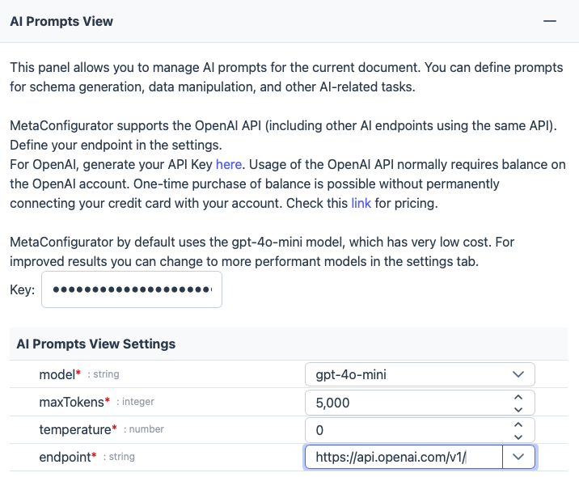

# AI Assistance

## Overview

MetaConfigurator provides different AI-assisted features to help you create and edit JSON schemas and instance data using natural language inputs.

Demonstration and Introduction video from the Allotrope Connect Workshop 2025 (click the image to open the video on Youtube):

## Requirements

By default, MetaConfigurator uses the public **Uni Stuttgart Relay**, which forwards to
**Helmholtz Blablador**. In that default setup, no browser API key is required.
Availability is best-effort and cannot be guaranteed.

If you switch to a direct provider connection, you need an API key from that LLM provider
(for example from [OpenAI](https://platform.openai.com/signup/)).

## Endpoint Configuration

To configure the LLM endpoint, open an AI-assisted feature (e.g., `Show AI Prompts View` button in the top menu bar) and expand the expandable/collapsible dialog.
Here, you can enter your API key and select the desired LLM endpoint (e.g., OpenAI GPT-4, Perplexity, or a custom endpoint) and other parameters.

The AI Endpoint Settings support three connection modes:

- **Uni Stuttgart Relay / HTTPS Relay**: use the default public relay or any other HTTPS MetaConfigurator relay.
- **Direct Endpoint**: connect straight from the browser to an LLM endpoint. This only works if that endpoint allows CORS requests.
- **HTTP Relay**: local HTTP-only variant for development.

If you want to self-host a relay, see [`backend/relay/README.md`](../../../backend/relay/README.md).

## How to Use AI Assistance

### Schema Creation and Editing

Open the AI Prompts View by clicking the `Show AI Prompts View` button in the top menu bar.
Now you can enter prompts to create or edit schemas using natural language.

### Schema Mapping and Data Transformation

In the `Data` tab, click `Utility...` -> `Transform Data to match the Schema...`.
This will open a dialog to generate a mapping configuration to map the current data to the target schema using AI.
The generated mapping configuration can be reviewed and adjusted before applying it to transform the data.

### Data Transformation to other Formats

In the `Data` tab, click `Utility...` -> `Export Data via Text Template...`.
This will open a dialog to generate a text template using AI to transform the current data to another format (e.g., XML, CSV, custom format).
The generated text template can be reviewed and adjusted before applying it to transform the data.
