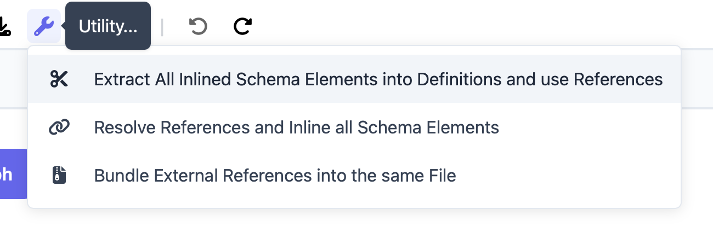
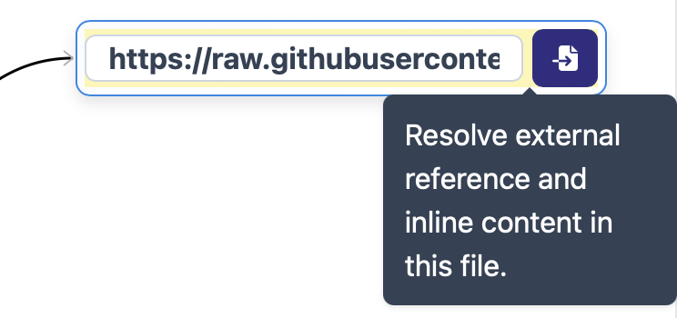

Handling external references in MetaConfigurator
================================================

While MetaConfigurator primarily focuses on the local JSON schema and data files, it provides basic support for external references.
External references allow you to include content from other files or URLs into your schema or data, enabling modularity and reuse.

Currently, the data tab and validation by default ignore external references, but the schema tab provides options to resolve all or some external references or bundle all content within the same schema with one click.
Once resolved, also the data tab and validation will take the content of the reference into account, as it is now part of the schema.

Resolving References in the Schema Tab
--------------------------------------

In the menu bar of the schema tab, there is a set of `utility` options for resolving all references or bundling a whole schema, as well as an inverse option (extract all inlined schema elements into definitions and replace them with references).

Furthermore, the schema diagram visualizes external references as nodes with a blue color frame and provides a button to resolve the reference directly in the diagram.

