# MetaConfigurator RDF Panel User Guide

This guide explains how to use the RDF panel in MetaConfigurator. You will move from plain JSON to a queryable and visual knowledge graph:

1. Start from structured JSON in the Data tab.
2. Open the RDF panel.
3. Convert JSON to JSON-LD with RML (optionally with AI drafting).
4. Review and edit triples in the RDF panel.
5. Use ontology assistance when choosing IRIs.
6. Run SPARQL queries (also with AI drafting).
7. Explore and refine the graph visually.

---

## Data

We use two main examples throughout this document: a simple simulation dataset and a MOF dataset.

- [`samples/simulation-data.json`](./samples/simulation-data.json)
- [`samples/simulation-mapping.ttl`](./samples/simulation-mapping.ttl)
- [`samples/simulation-data.jsonld`](./samples/simulation-data.jsonld)
- [`samples/simulation-query.sparql`](./samples/simulation-query.sparql)

- [`samples/mof-data.json`](./samples/mof-data.json)
- [`samples/mof-mapping.ttl`](./samples/mof-mapping.ttl)
- [`samples/mof-data.jsonld`](./samples/mof-data.jsonld)
- [`samples/mof-prep-query.sparql`](./samples/mof-prep-query.sparql)

---

## 1) Start with JSON Data

Begin with your normal structured JSON (simulation data, lab records, process logs, etc.).

- Simulation example: [`samples/simulation-data.json`](./samples/simulation-data.json)
- MOF example: [`samples/mof-data.json`](./samples/mof-data.json)

Open the RDF panel in the Data tab by clicking the globe icon.

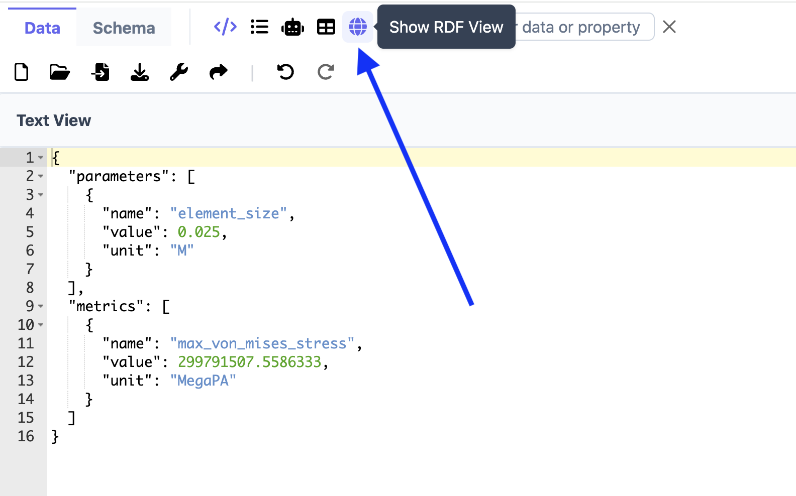

Initially, the panel shows a warning that your data is not in JSON-LD format. This means:

- Your data is already valid JSON.
- It is not yet ready for semantic querying until converted to JSON-LD.

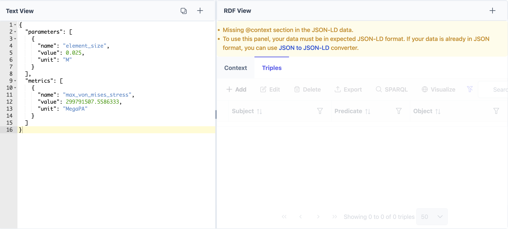

Now you have two options to proceed:

- Use the **JSON to JSON-LD** (RML conversion) tool, or
- Use **Turtle import** if your data is already in RDF/Turtle format.

Before using RML mapping, please review the RML documentation at [this link](https://rml.io/docs/rml/introduction/).

---

## 2) Convert JSON to JSON-LD with RML

Use the RML mapping dialog to define how JSON fields become RDF entities and relationships.

Again, you can proceed in two ways:

- Paste an existing RML mapping, or
- Generate a draft mapping with AI and then adjust it.

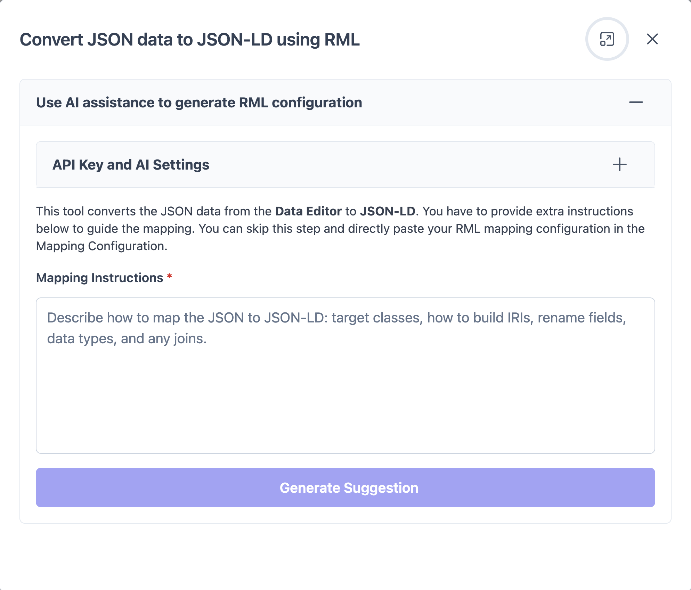

Sample mappings:

- Simulation mapping: [`samples/simulation-mapping.ttl`](./samples/simulation-mapping.ttl)
- MOF mapping: [`samples/mof-mapping.ttl`](./samples/mof-mapping.ttl)

Practical recommendation:

- Treat AI-generated mapping as a first draft.
- Confirm identifiers, classes, and property choices before applying.

---

## 3) Inspect and Edit JSON-LD / RDF Triples

After conversion, the RDF panel gives two synchronized tabs:

- **Context**: manage prefix and context definitions.
- **Triples**: manage subject-predicate-object statements.

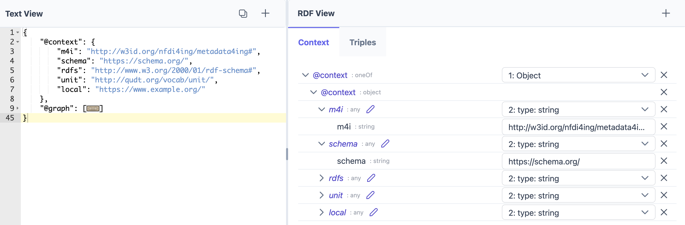

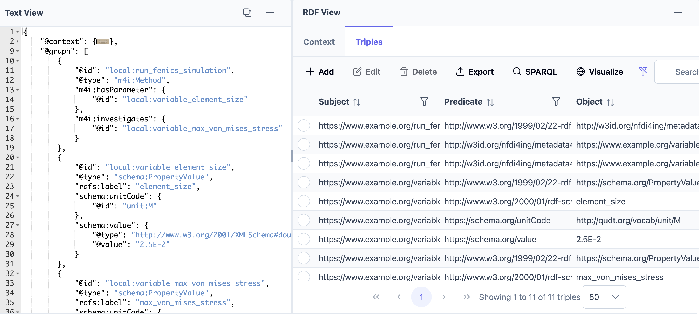

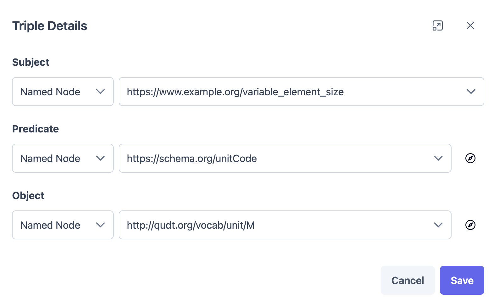

Typical tasks in the **Triples** tab:

- Add, edit, and delete triples.
- Search and filter across subject, predicate, object.
- Export graph data as Turtle, N-Triples, or RDF/XML.
- Open SPARQL and visualization directly from the same toolbar.

Note: If you filter data in the Triples tab and then open the visualization dialog, you will see only the graph for the filtered data, not the entire dataset.

Sample JSON-LD outputs:

- Simulation: [`samples/simulation-data.jsonld`](./samples/simulation-data.jsonld)
- MOF : [`samples/mof-data.jsonld`](./samples/mof-data.jsonld)

---

## 4) Use Ontology-Assisted IRI Selection

When editing predicates or object IRIs, open **Ontology Explorer** for guided selection.

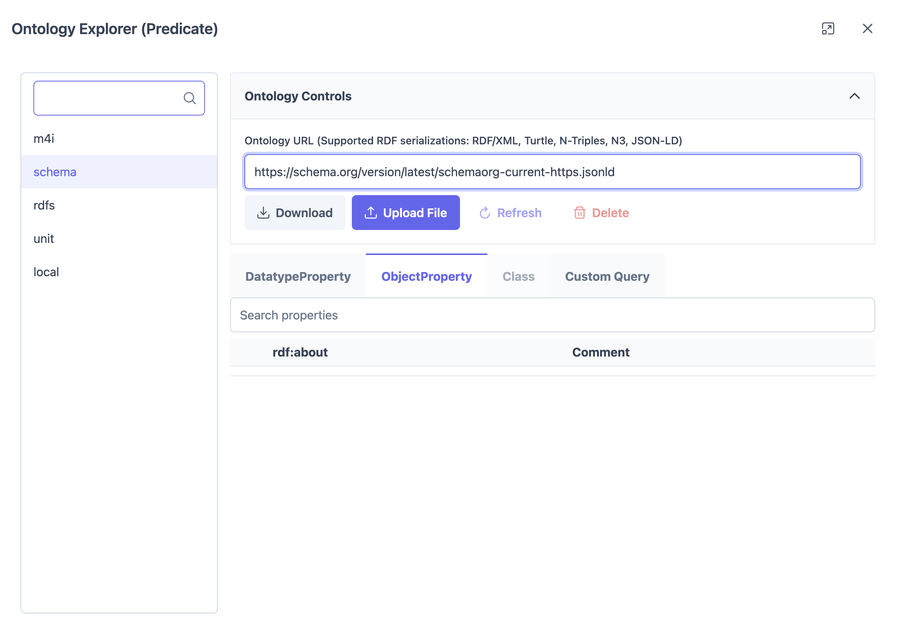

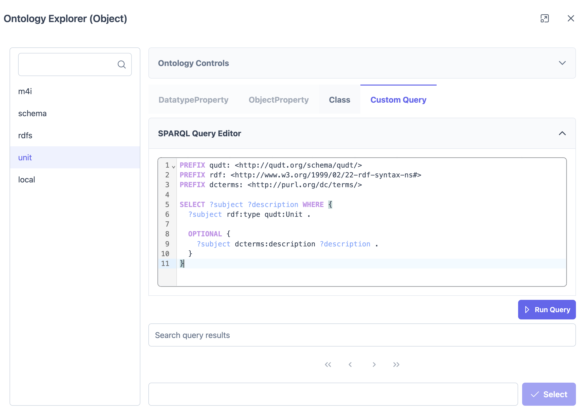

What you can do there:

- Select a prefix from your current `@context`.
- Download ontology content by URL or upload an ontology file.
- Reuse cached ontology data, refresh it, or delete it.
- Browse `DatatypeProperty`, `ObjectProperty`, and `Class` terms.
- Use ontology-side SPARQL to discover additional terms quickly.
- Pick a term and insert it back into the triple editor.

This is especially helpful for consistent use of units, classes, and shared vocabularies.

---

## 5) Query with SPARQL (Optional AI Drafting)

Open SPARQL from the triples toolbar to validate and analyze your graph.

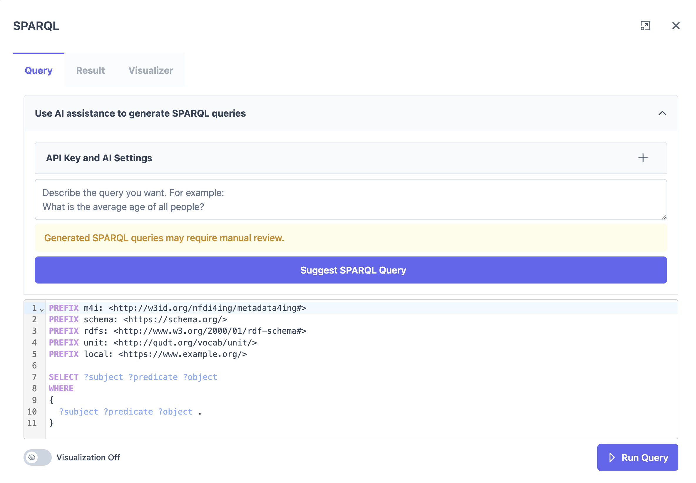

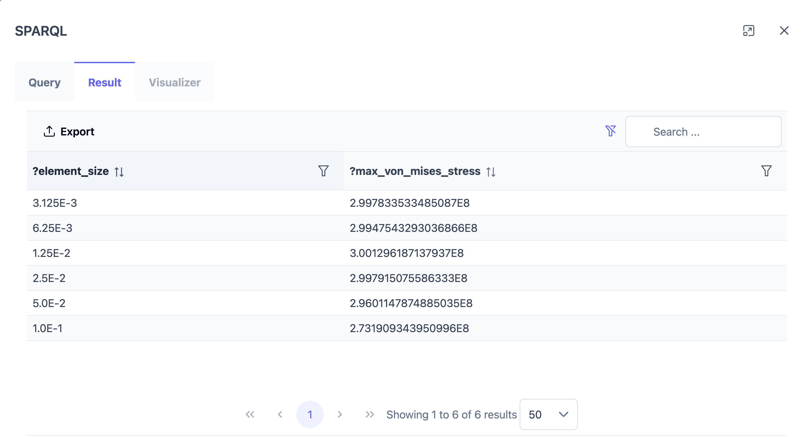

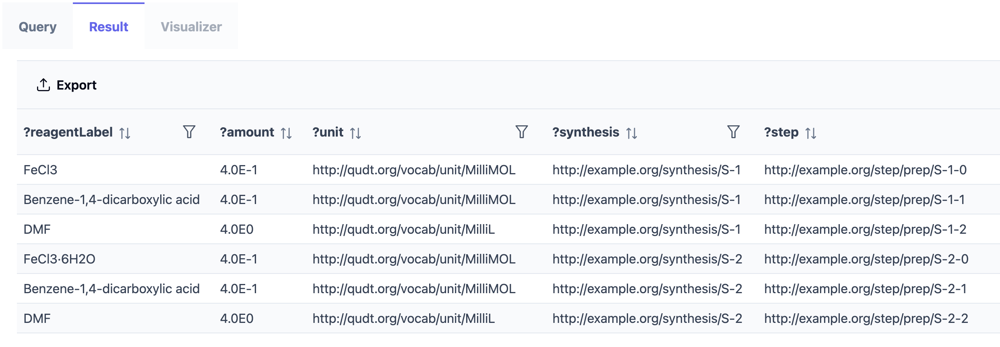

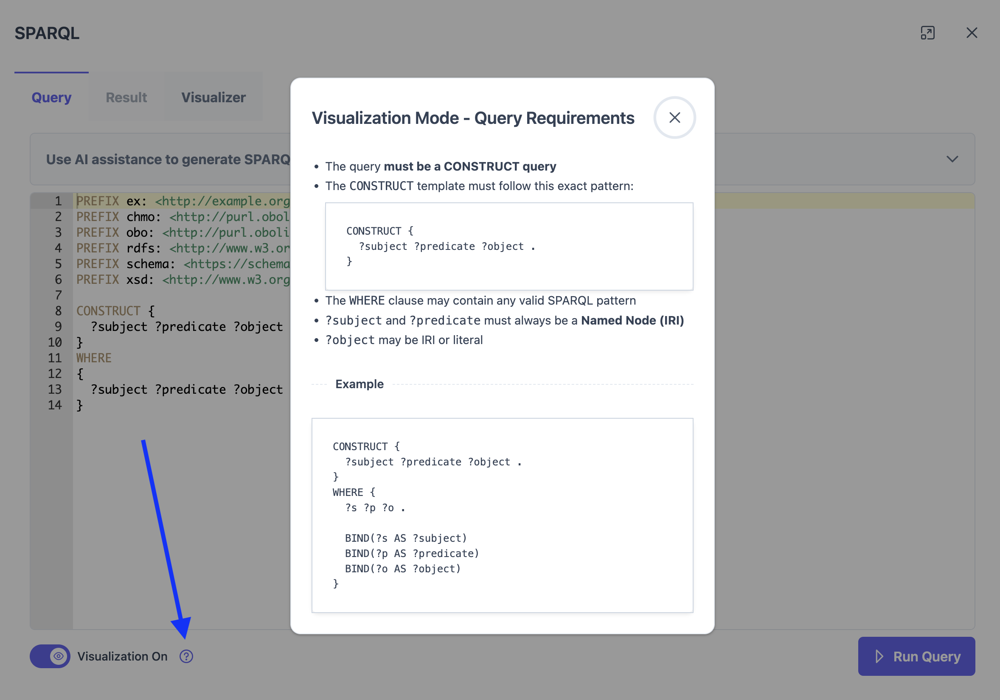

In this dialog, you can:

- Write or paste SPARQL manually.
- Ask AI to draft a query from a natural-language prompt. You can ask question from your data, since a subset of your JSON-LD data is being sent to the AI-endpoint.
- Run query and inspect results in a filterable table.
- Export results (CSV for tabular outputs when visualization is disabled, and RDF-based extensions for visualization-based queries).

Visualization note:

- You can enable query-result visualization mode.
- This mode expects a graph-shaped query result (CONSTRUCT-style output).
- You can also click the visualization help icon near the toggle for more information on how to create a valid query for visualization.

Sample queries:

- Simulation: [`samples/simulation-query.sparql`](./samples/simulation-query.sparql)
- MOF prep-step: [`samples/mof-prep-query.sparql`](./samples/mof-prep-query.sparql)

---

## 6) Visualize and Refine the Knowledge Graph

Use **Visualize** to inspect relationships as a graph.

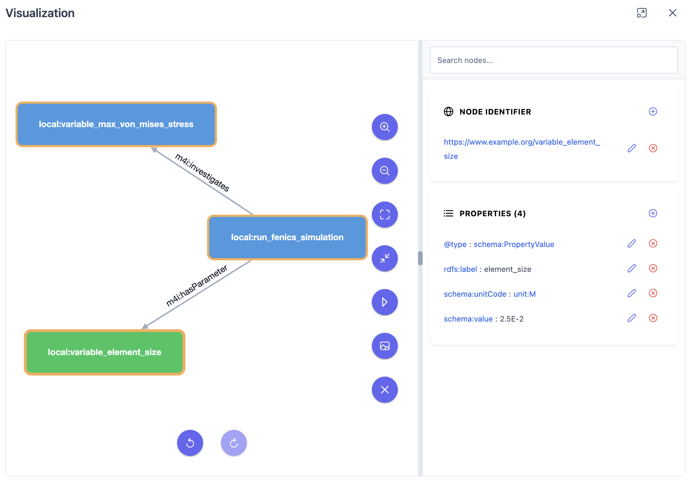

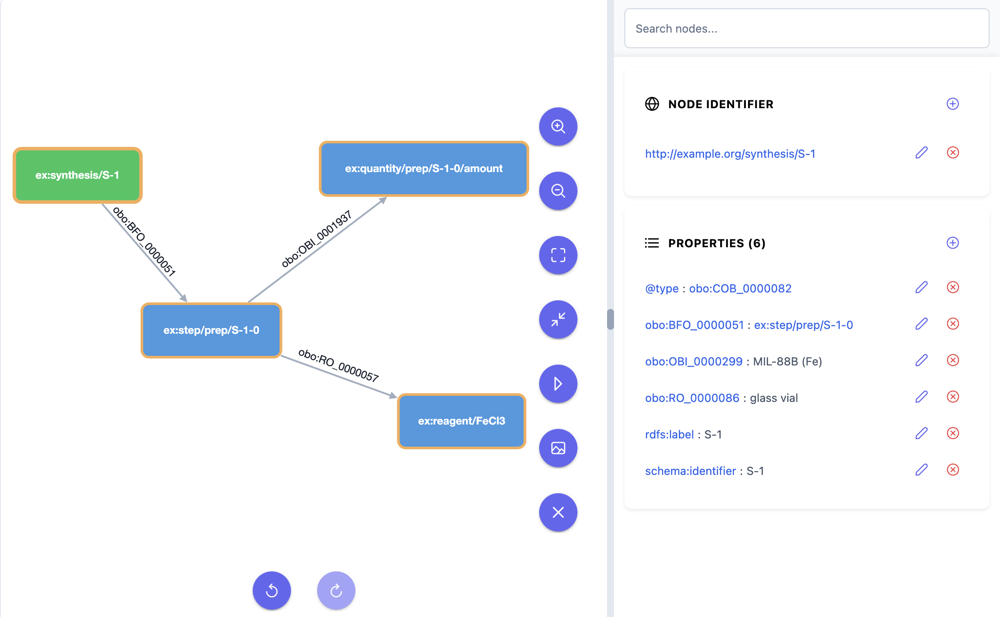

Two visualization modes:

- From RDF Triples tab: **editable graph** (rename node, add/delete properties, add/delete nodes).
- From SPARQL visualizer tab: **read-only graph** for query result exploration.

Useful actions in the visualization dialog:

- Node search and quick focus.
- Zoom controls and fit-to-view.
- Optional layout animation.
- Export graph image.
- Undo/redo for edits.

For very large graphs, the app warns before rendering and lets you continue or cancel.

---

## Recommended End-to-End Workflow

1. Validate raw JSON in Data/Schema views.
2. Convert JSON to JSON-LD using RML (manual or AI draft).
3. Confirm context prefixes and main entities in RDF panel.
4. Clean up triples (missing links, wrong predicates, units, datatypes).
5. Use Ontology Explorer for consistent vocabulary choices.
6. Run SPARQL checks for your key domain questions.
7. Inspect the graph visually and refine remaining issues.
8. Export RDF or query results for downstream use.

---

## Practical Quality Checks

- Ensure important entities use stable and reusable identifiers.
- Keep prefix usage consistent between `@context`, triples, and queries.
- Use ontology IRIs for units/classes/properties instead of only plain text.
- Review AI-generated mapping/query drafts before trusting them.
- If the triple list is shortened due to display limits, increase RDF display limits in settings before final review.
- Use Named Nodes (nodes with `@id`) instead of Blank Nodes. This makes it easier to find and edit triples in the Text view.
