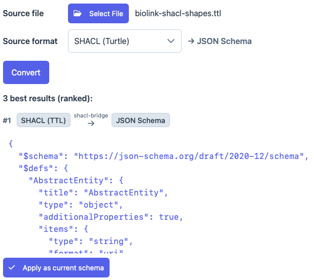
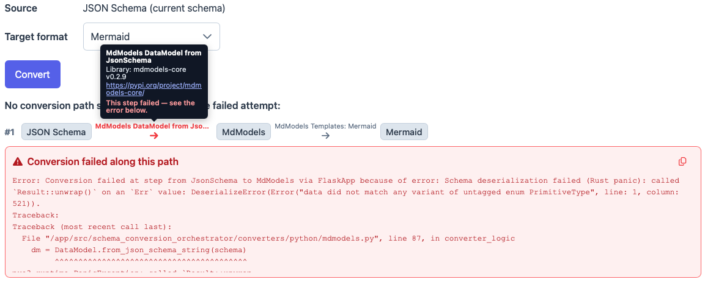

# Schema Conversion (Import / Export of other schema formats)

MetaConfigurator can convert schemas between JSON Schema and a range of other modeling languages (XSD, SHACL, LinkML, MD-Models, and more).
This makes it possible to import a schema authored in another language for editing and visualization, or to export the current JSON Schema to a different target format.

The conversions are performed by the *Schema Conversion Orchestrator*, a backend service that chains together existing converter libraries to find a path from the source to the target language.
A public instance is used by default; the endpoint can be changed in the settings (`backend → schemaConverterUrl`).

> **Note:** Schema conversions are usually lossy and ambiguous: different valid results are possible depending on the conventions used by the converters. Always verify the converted schema before using it.

## Importing a schema from another format

Switch to the **Schema Editor** tab. In the top menu bar, open **`Open / Import / Infer Schema...` → `Import Schema from another format...`**.

In the dialog:

1. Click **Select File** and choose the schema file. The **Source format** is detected automatically from the file extension and can be adjusted.
2. The target is always **JSON Schema**.
3. Click **Convert**.

The ranked conversion results are listed, best path first. Each successful result shows the converted schema and can be applied to the editor via **Apply as current schema**.

## Exporting the current schema to another format

In the top menu bar, open **`Export Schema...` → `Export Schema to another format...`**.

The source is the current JSON Schema. Select a **Target format** (e.g. XSD, SHACL, LinkML, MD-Models, GraphQL, Protobuf, ShEx, OWL, Mermaid, SQLAlchemy) and click **Convert**.
Each result can be copied to the clipboard (**Copy**) or saved (**Download**).

## Conversion paths, provenance and errors

For every attempt, the dialog renders the full **conversion path** as a sequence of language nodes connected by labeled edges, one edge per converter step.
Hovering over an edge reveals the converter's **library name, version, and a link** to it, so you can see exactly which tool produced a result (useful for citing or reporting issues).

When a path fails, the responsible edge is highlighted and the corresponding **error message** (plus intermediate results, if any) is shown, giving actionable diagnostics.

## Supported formats

- **Import (→ JSON Schema):** XSD, DTD, SHACL (Turtle), LinkML, MD-Models
- **Export (JSON Schema →):** XSD, SHACL (Turtle / JSON-LD), LinkML, MD-Models, GraphQL, Protobuf, ShEx, OWL (Turtle), Mermaid, SQLAlchemy

Only conversions that have JSON Schema as the source or the target are surfaced here; conversions directly between two other languages remain available through the orchestrator's API.
