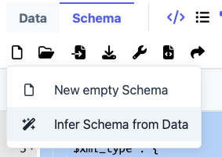
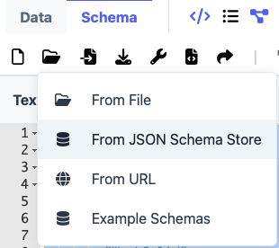
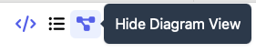
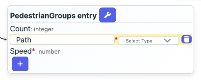
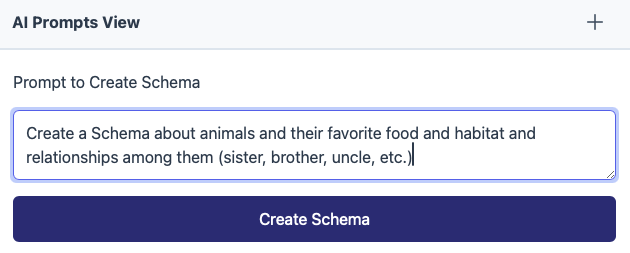
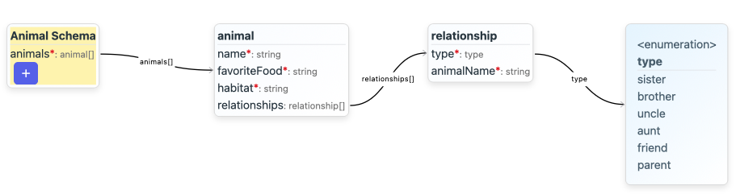
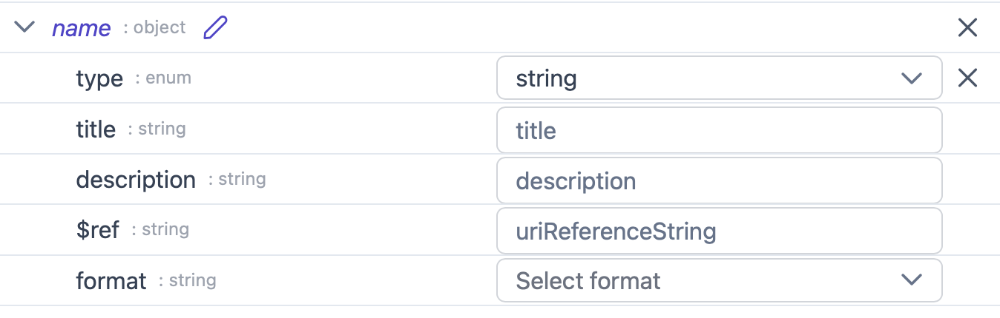
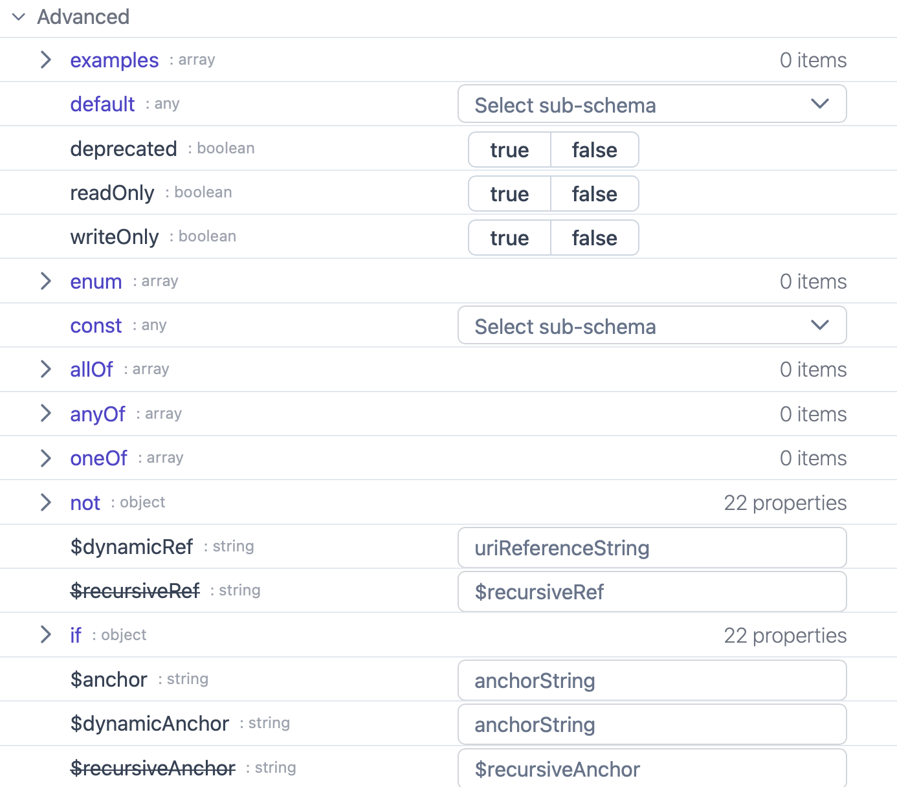

# Schema Creation

## Overview

MetaConfigurator is a **schema editor** for JSON schemas.
It can be used to create and edit JSON schemas using a user-friendly interface.

## How to Generate Schemas in MetaConfigurator

### Automatically Infer a Schema from Data
If you already have an instance dataset for which you want to create a schema, you can infer a schema from the data.
1. Open MetaConfigurator.
2. Paste/Open your instance data in the `data editor` tab.
3. Switch to the `schema editor` tab.
4. In the top toolbar on the left click **"New Schema..." --> "Infer Schema from Data"**

A new schema will be created based on the data you provided.
Note that it will only as complete as the data you provided.
It is very likely that you will need to further edit the schema to make it more complete and robust but the inferred schema is a good starting point.

Main limitations of the inferred schema:
- It will not contain any descriptions or titles.
- It will not contain any constraints (e.g. min/max values, string patterns, etc.)
- It will not contain any enumerations because it cannot distinguish between an arbitrary string/numerical input and a list of possible values.

All of these can be added manually in the schema editor in retrospect.

### Explore Existing Schemas in the JSON Schema Store

Possibly the schema that you want to create is similar to an existing schema.
You can open and edit/re-use or learn from existing schemas.
To explore existing schemas, in the `schema editor` tab, in the top toolbar click **"Open JSON Schema..." --> "Open from JSON Schema Store"**.

You can then browse and search the JSON Schema Store for existing schemas.

### Create and Editing Schemas Manually

There are different views in MetaConfigurator to create and edit schemas manually.
Each has its own advantages and disadvantages.
You can toggle (`on`/`off`) the different views using the buttons in the top toolbar:

In the menu bar you can also switch between a `Simple` and an `Advanced mode`.
In the advanced mode, more complex schema features are available (e.g., boolean schemas, multiple types assigned to a property, etc.), but the GUI View looks more complex.

#### Text View

The text view allows you to edit the raw JSON schema.
It is the most flexible view but also requires the most knowledge about JSON schema syntax.

#### Diagram View

The diagram view allows you to create and edit schemas using a graphical interface.
It is the most user-friendly view but also the least flexible.
Click on a node to add properties or rename it.
Click on an attribute of a node to edit its name or type.
Some nodes might not allow editing their names, due to them being inlined in the raw schema document (e.g., they don't have their own name).
To change their name more flexibly, you can press the `Extract inlined object schema to definitions' button.
This will extract them into the `$defs` section of the schema and make their names editable.

#### AI Prompts View

You can also use AI to help you create and edit schemas.
Therefore, open the AI prompts view and enter your authentication token for your AI endpoint in the settings.

You can then enter prompts to create or edit schemas.

Resulting schema of the sbove prompt:

#### GUI View

The GUI View shows all the different possible fields for a schema, based on the JSON Schema Meta Schema.
It is useful to get to know all the different types of constraints, composition and other advanced schema features, but it can be a bit complex or overwhelming in the beginning.

## Hints and Tips

1. **Use Titles and Descriptions**: This will be beneficial for the generated code, documentation and also the GUI View when editing instance data.
