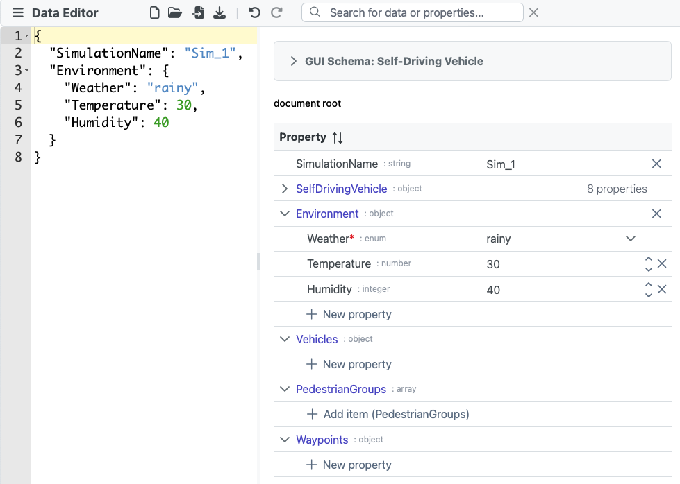
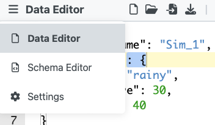
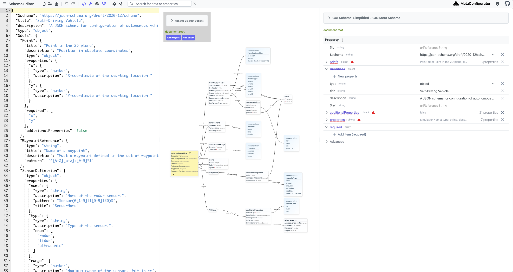
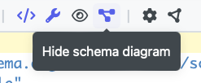
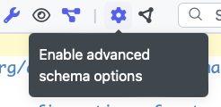
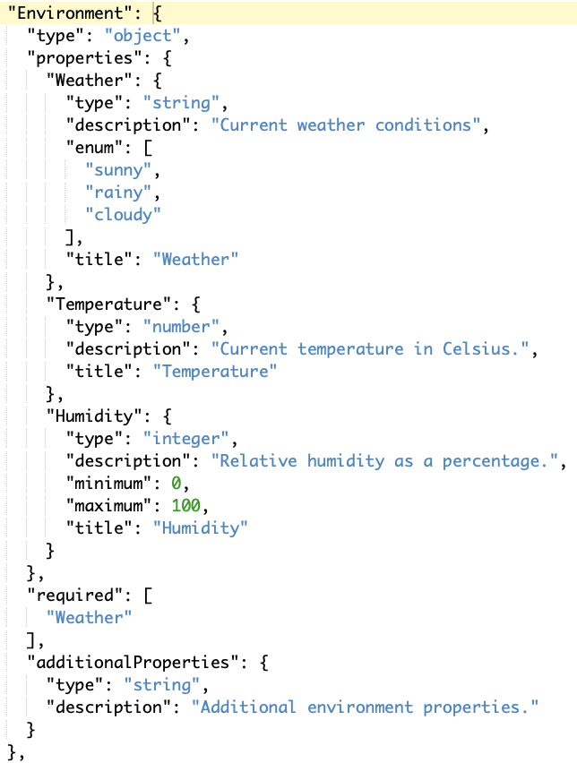
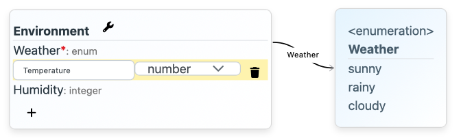
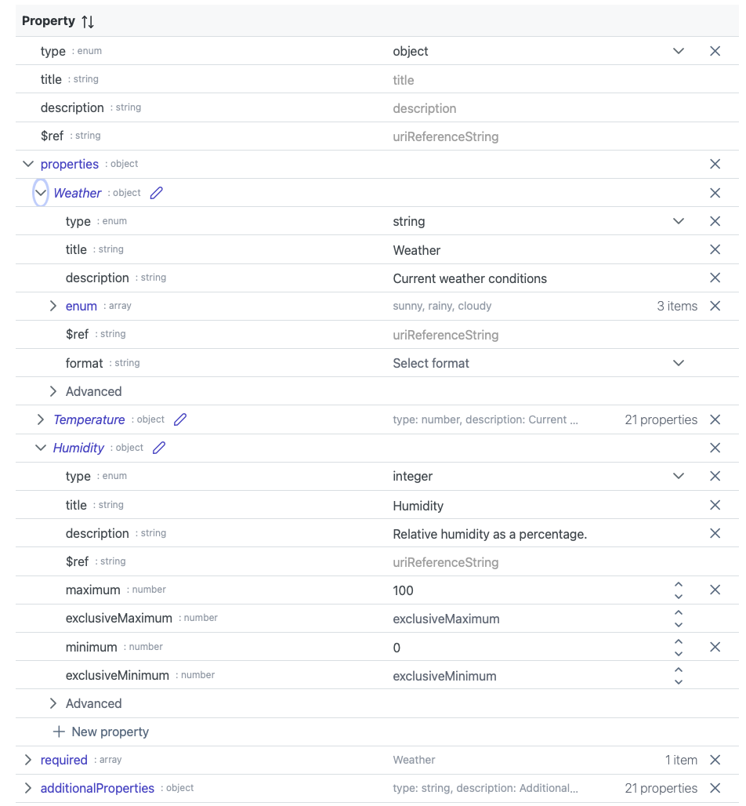

# Examples and Documentation

## Load a Schema

On startup, select a schema to load or start with an empty schema.
Use the option ``From JSON Schema Store`` to load the schema from a big selection of known schemas.
To load your own schema, use the option ``Open Schema File`` for selecting a file from your hard drive or use the option ``Load Schema from URL`` for loading a schema from a URL.

## Edit Data based on the Schema
Having a schema loaded, MetaConfigurator will display a text editor and a GUI editor for entering data, based on the schema.

## Edit or Create a Schema
For editing or creating your own data model (schema), navigate to the Schema Editor tab in the top left.

You will get a view with different panels: a text editor, interactive diagram, and GUI editor.

In the top menu bar, you can select which panels to show or hide.

Also, MetaConfigurator has a simple mode (easier to use, less complicated options) and an advanced mode (more schema features) for the schema editor.
In the top menu bar, you can switch between the modes.

### Text Editor

In the text editor panel, you can edit the schema in its raw JSON format, following the ``JSON Schema`` standard.
This panel is best for advanced users who are familiar with the JSON schema format.
It allows for copy and paste and other fast editing options, but requires knowledge of the JSON schema standard.

### Diagram Editor

In the diagram editor panel, you can interactively create and edit the schema.
It is the most user-friendly way to create a schema, however, some advanced schema options are not available in this view.

### GUI Editor

In the GUI editor panel, you can edit the schema in an assisted manner, with checkboxes for booleans, dropdowns for enums, etc.
Depending on the mode (simple or advanced) you have more or less options available.
The advanced mode does show all schema options, including conditions and composition.
This view is recommended to everyone who wants to use more schema features than the diagram editor offers.
The only downside is that it might require more clicks to set up the schema than the text editor.

