# Biochemistry Example


[](https://www.youtube.com/watch?v=1HT0Xb8tGUI)

*Click the image to get to a Youtube Video performing the steps of this example*


This hands-on example demonstrates how to:

1. Import a table from Excel/CSV into MetaConfigurator
2. Automatically infer the data model and generate a schema
3. Use the MetaConfigurator UI to make changes to the schema
4. Export the schema and data to a JSON file
5. Profit from having the data and schema in a machine-readable format by applying a simple Python script on it, enriching the synthesis data with additional metadata from the PubChem database

The example is based on a dataset of metal-organic framework (MOF) synthesis data.
MetaConfigurator itself, however, is a generic tool and can be used for any kind of data of any domain.

The goal is to demonstrate how data from Excel/CSV can be turned machine-readable using MetaConfigurator.
Also, it is shown how a data model (schema) can be created, which will helpful to communicate the structure of the data to others.
Finally, we show that having the data in this machine-readable format allows for easy integration with other tools and services, such as the PubChem database.
This applies for any kind of data: once it is in a machine-readable format, any tooling, programming language and also machine learning can be applied on it.

## Step 1: Import the data

Download the [ec-mof-synthesis.csv](ec-mof-synthesis.csv) file.
Note that the data was originally in an Excel file and was exported to the CSV format already.
 
Open MetaConfigurator and click on the "Import Data..." button (not to be confused with the "Open Data" button).

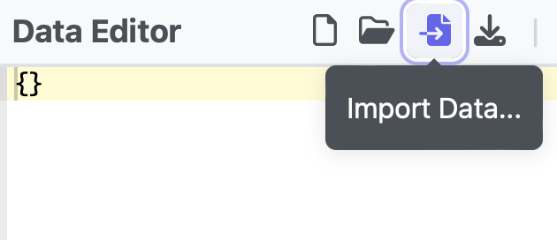

Select the "Import CSV Data" option and choose the `ec-mof-synthesis.csv` file.

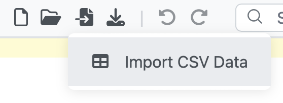


Keep the "Independent Table" and "Infer and generate schema for the data" options selected.

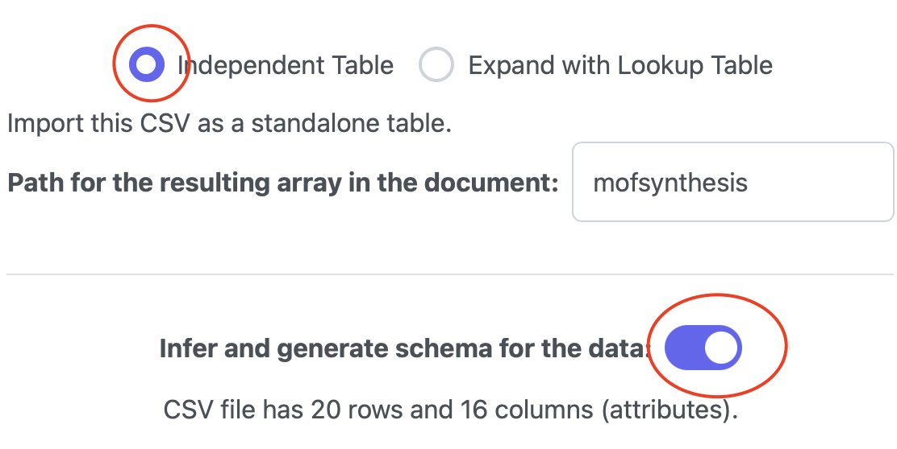

Press the "Import" button to import the data and generate the schema.

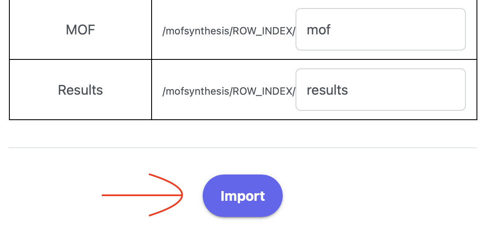

Now the data is successfully imported and the schema is generated.

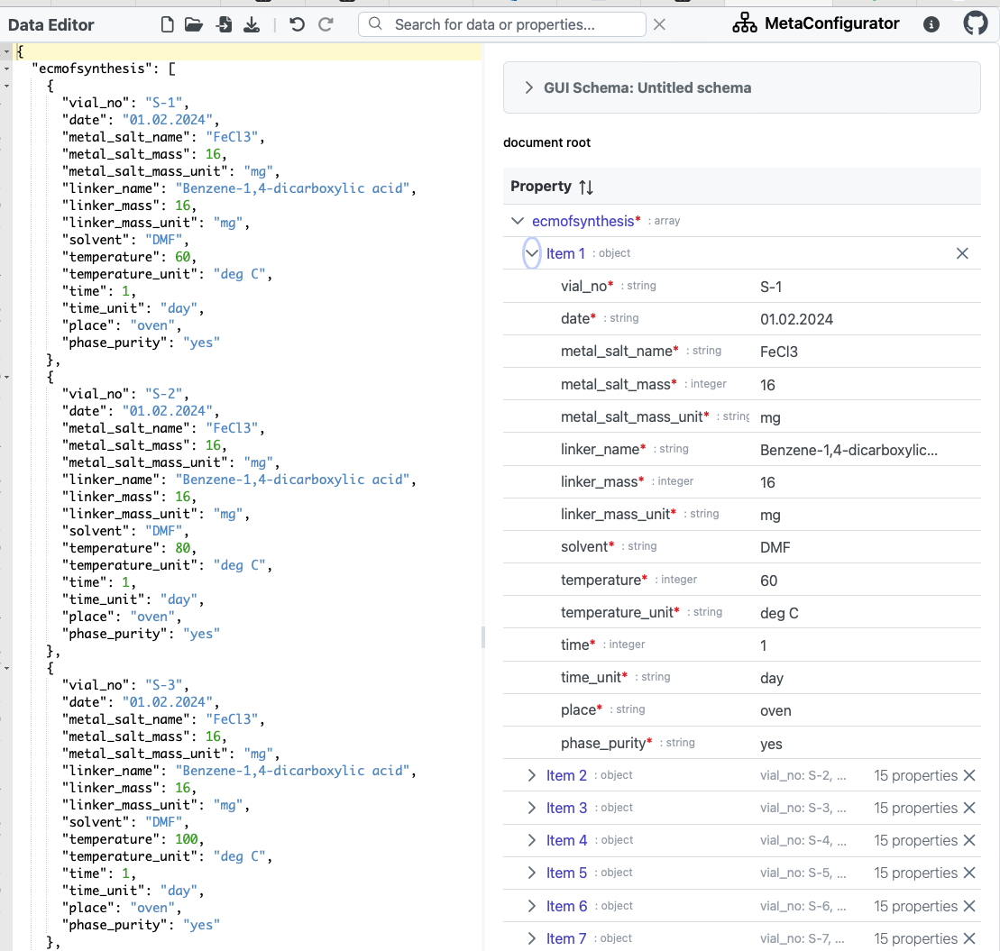


## Step 2: Making changes to the schema

The schema generated by MetaConfigurator can be further refined.
Notice, that the `phase_purity` attribute is inferred as a string, but it should be a boolean (True/False) value.

First, let's navigate to the Schema Editor tab, by clicking the "Data Editor" button on the top left and then selecting the "Schema Editor" tab.

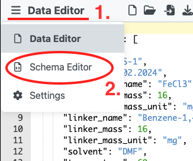

This tab has different available views.
The text view shows the schema in its raw text form in JSON format.
It is best to be used by advanced users who are familiar with the JSON schema format.
The GUI view is more user-friendly and assists the user by showing all options available for defining the schema.
The most easy and simple view is the diagram view, which shows the schema in a graphical form.
Some more advanced schema options, such as conditionals and composition, can not be achieved in the diagram view and require the GUI or text view.
For our example, the diagram view is sufficient. 
Hence, let's hide the other views and open only the diagram view.
This can be done using the top toolbar.

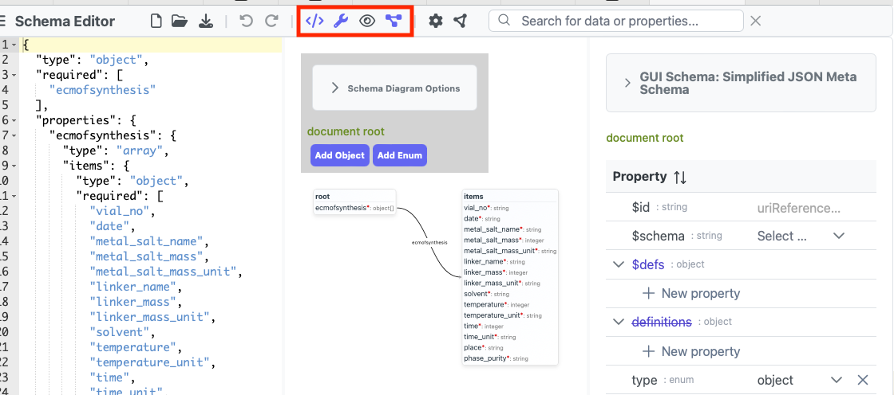

Click on the buttons to hide the text editor and the GUI editor.
Afterward, only the diagram view should be visible.

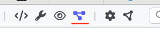

In the diagram, click on the `phase_purity` attribute to edit it.
Then, change the type to "boolean".

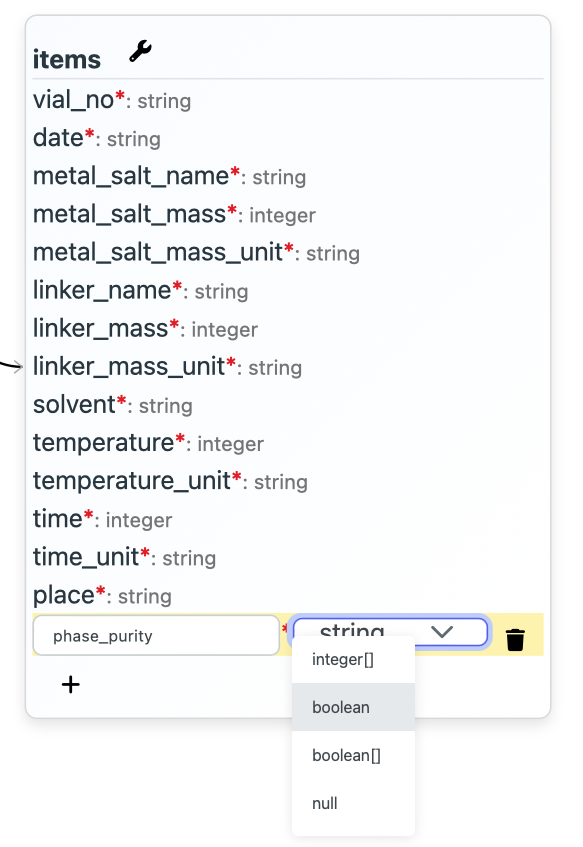

In the top menu bar, ckick the "Show Preview of resulting GUI" button to see how the schema will look like in the GUI view.


In the GUI view, the `phase_purity` attribute is now represented as a checkbox instead of a text field.
Todo: auto-convert yes and no values?

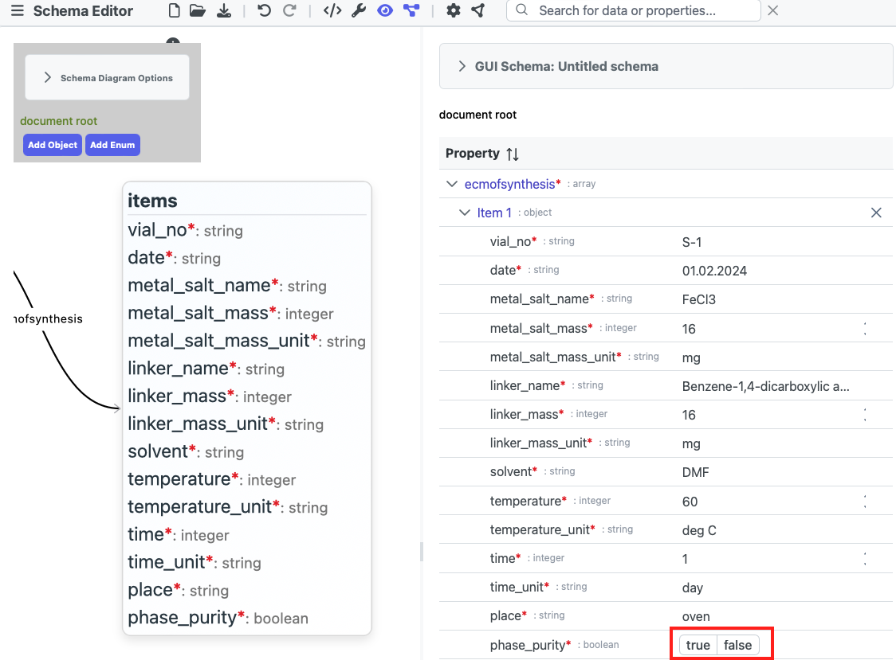

In our data, we also notice that `metal_salt_mass_unit` and `linker_mass_unit` both seem to be the same unit.
Rather than allowing an arbitrary string for these fields, we can define a common unit type, which is used by both attributes.
This can be done by adding a new enum to the schema, by clicking on the "Add Enum" button in the diagram view.

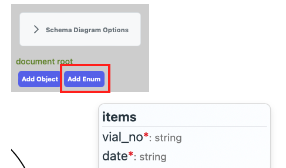

A new dummy enumeration will be added to the schema.
Change the name of the enumeration to `mass_unit` and add the possible values `kg`, `g` and `mg`.

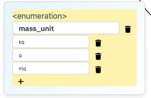

Now, change the type of the `metal_salt_mass_unit` and `linker_mass_unit` attributes to the newly defined `mass_unit` enumeration.

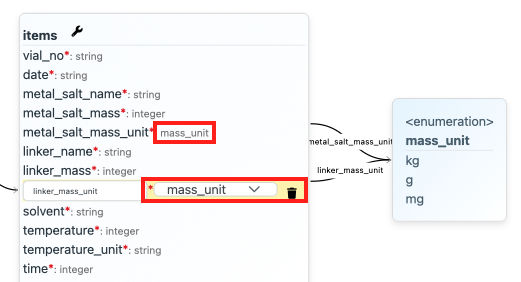

This will automatically create new edges from the attributes to the enumeration in the diagram.
Notice, that in the GUI preview, the `metal_salt_mass_unit` and `linker_mass_unit` attributes are now represented as dropdowns with the possible values.

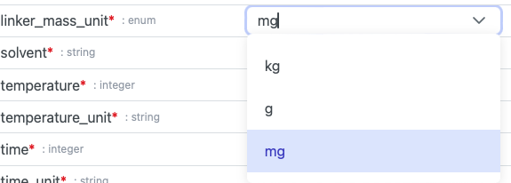

In the same manner, create a new enum `time_unit` with the values `s`, `min`, `h`, `day` and `week`.
To the `time_unit` attribute, change the type to the new enumeration.

Also do the same for the `temperature_unit` attribute, with the values `K`, `deg C` and `deg F`.

The resulting schema is provided in the [ecmofsynthesis.schema.json](ecmofsynthesis.schema.json) file.
The data is provided in the [ecmofsynthesis.json](ecmofsynthesis.json) file.

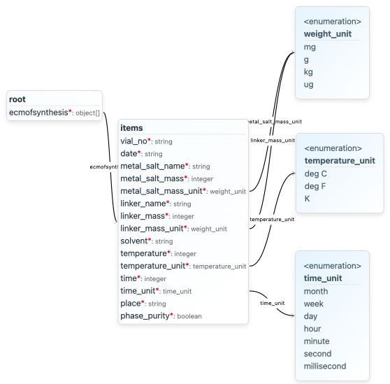

## Step 3: Enriching the data with additional metadata

Having this initial data model (schema) and data, now we want to apply a Python script on the data, which extends all the compounds (metal salt and linker) with additional metadata from the PubChem database:
- Inchi Code
- Smiles Code
- Molecular Weight
- cid (PubChem Compound ID)

Let's first adapt our data model and add the new attributes to the schema.
Because the new attributes apply to both the `metal_salt` and `linker` compounds, we define a new schema object `compound`.

Click on the 'Add Object' button in the diagram view to add a new object to the schema.
Change the name of the object to `compound`.
Add the following attributes:
- `inchi_code` (string)
- `smiles_code` (string)
- `molecular_weight` (number)
- `cid` (number)

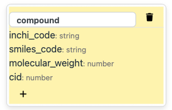

Now, we can introduce a new property `metal_salt` of type `compound` to the schema.
Let's do the same for the `linker` property.

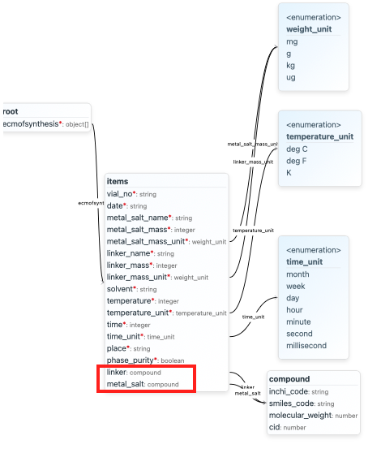

The resulting schema is provided in the [ecmofsynthesis_enriched.schema.json](ecmofsynthesis_enriched.schema.json) file.

Note that the design of the data model itself is up to preference and use case.
In this example, we added a new object `compound` to the schema, which is used by both the `metal_salt` and `linker` properties.
We did NOT CHANGE any existing properties, but only added new ones.
It would also be a valid choice to move the `metal_salt_mass_unit`, `metal_salt_mass`, `linker_mass_unit` and `linker_mass` attributes to the `compound` object.
The same applies for the `linker_name` and `metal_salt_name` properties.
They could also be fully removed, as the `cid` attribute will be used to identify the compounds (exception: if no corresponding molecule is found in PubChem, then information would be lost).

Now, let's write a Python script to enrich the data with the additional metadata: [enrich_data.py](enrich_data.py).
Run the script using Python and from the same folder where the `ecmofsynthesis.json` file is located.

```bash
python enrich_data.py
```
or
```bash
python3 enrich_data.py
```

The resulting JSON file is provided in the [ecmofsynthesis_enriched.json](ecmofsynthesis_enriched.json) file.

If we load the enriched data into MetaConfigurator (using the 'Import Data' button), we can see that the `metal_salt` and `linker` properties now have the additional metadata.

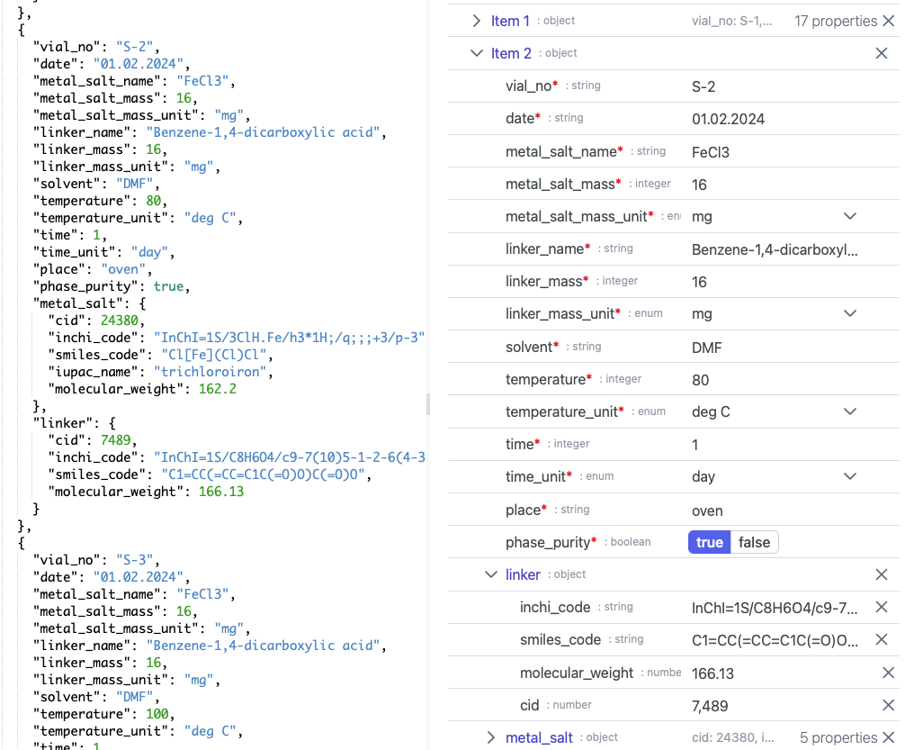

## Takeaways

This example demonstrated how to import data from Excel/CSV into MetaConfigurator, generate a schema and make changes to the schema.
It also showed how to enrich the data with additional metadata from the PubChem database using a Python script.

By having the data in a machine-readable format, it is easy to apply additional tools and services on it.
This can be useful for data integration, data analysis, data visualization, machine learning and many other applications.
MetaConfigurator is a generic tool and can be used for any kind of data of any domain.
